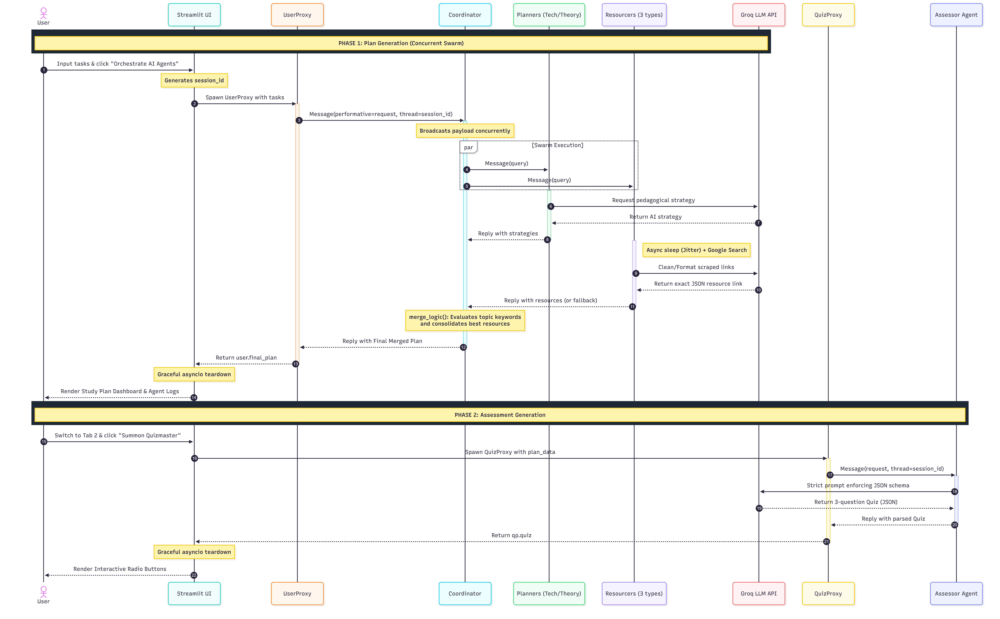

# Collaborative Study Intelligence System

## Overview

The **Collaborative Study Intelligence System** is an advanced Distributed Multi-Agent System (MAS) designed to automate, optimize, and evaluate academic study sessions. Developed as a Master 1 project in Artificial Intelligence and Data Science at the University of Larbi Ben M'Hidi, the system orchestrates a swarm of specialized AI agents. These agents work concurrently to generate tailored pedagogical strategies, fetch domain-specific resources, and construct interactive quizzes.

## Key Features

- **Asynchronous Agent Swarm:** Built on the SPADE framework to run multiple AI agents concurrently without blocking the main execution thread.
- **Intelligent Routing:** A central Coordinator agent dynamically routes tasks to specialized "Technical" or "Theoretical" planners based on semantic keyword analysis.
- **Anti-Bot Resource Fetching:** Staggered, domain-specific scraping for Academic papers, YouTube tutorials, and GitHub code, complete with fallback mechanisms to bypass rate limits.
- **Interactive UI Integration:** A synchronous Streamlit frontend cleanly integrated with the asynchronous SPADE backend via thread-safe UI updates and graceful event loop teardowns.
- **Session Management:** Robust Thread IDs ensure fully isolated execution, allowing multiple parallel users to query the swarm simultaneously without data crossover.

## Architecture & Tech Stack

- **Multi-Agent Framework:** SPADE (Smart Python Agent Development Environment) over XMPP
- **Frontend & State Management:** Streamlit
- **LLM Engine:** Groq API (Llama-3.3-70b-versatile / Llama-3.1-8b-instant)
- **Concurrency:** Native Python `asyncio`

# Sequence Diagram

<p align="center">
  
</p>

## Limitations & Known Issues

- **Google Scraping Rate Limits:** The retrieval agents rely on web scraping. Despite implementing jitter (randomized delays), aggressive querying can still trigger Google's anti-bot mechanisms (HTTP 429), forcing the system to rely on fallback URLs.
- **Synchronous API Blocking:** While the SPADE framework runs asynchronously, the current implementation uses the synchronous Groq Python client. This means LLM generation can momentarily block the event loop, preventing true parallel execution of API calls.
- **Ephemeral State (No Persistence):** Currently, study plans and quizzes are stored in Streamlit's `session_state`. If the server restarts or the user refreshes the page, all generated data is lost.
- **Static Quiz Evaluation:** The Assessor Agent successfully generates interactive quizzes, but there is no overarching scoring system or analytics dashboard to evaluate the user's performance.

## Future Improvements

- **Database Integration:** Implement a persistent database architecture (e.g., PostgreSQL or MongoDB) to save user profiles, historical study plans, and quiz results.
- **Cloud Deployment:** Migrate the local XMPP server (e.g., Ejabberd) and the SPADE Python agents to a dedicated Virtual Private Server (VPS) for robust, 24/7 online availability.
- **Mentorship & Tracking Agents:** Introduce a new "Mentor Agent" designed to monitor (_suivi_) the user's study progress over time, send proactive study reminders, and adjust future generated plans based on past quiz scores.
- **Advanced LLM Capabilities:** Upgrade to more specialized models, fine-tune existing models on academic pedagogical data, or implement Retrieval-Augmented Generation (RAG) to allow the agents to read directly from the user's specific university textbooks.

## Prerequisite Setup

To ensure the system runs without rate-limit conflicts, every team member must configure their own environment.

### 1. Get your Groq API Key

- Sign up at the [Groq Cloud Console](https://console.groq.com/keys).
- Generate a free **API Key**.
- _Note: Using individual keys prevents "429: Too Many Requests" errors during team testing._

### 2. Create an XMPP Account

- Register a unique Jabber ID (JID) at [xmpp.jp](https://xmpp.jp/)
- Example: `username@xmpp.jp`
- _Note: Each teammate needs a unique JID to avoid connection drops if multiple people test the system at once._

---

## Installation & Execution

### Step 1: Clone and Environment

```bash
# Clone the repository
git clone https://github.com/Bergal-Akram/AI-Multi-Agent-Study-System.git
cd SMA_Project

# Create and activate a virtual environment
python -m venv venv

# Windows:
venv\Scripts\activate

```

### Step 2: Install Dependencies

```bash
pip install -r requirements.txt
pip install spade streamlit groq googlesearch-python python-dotenv tenacity

```

### step 3: Configure Environment Variables (.env)

#### The system uses environment variables for security. Never push your actual .env file to GitHub.

1. In the root folder, create a file named .env.

2. Copy the content from .env.example into .env.

3. Fill in your real credentials:

```bash
GROQ_API_KEY=gsk_your_api_key_here
USER_JID=user@your_xmpp_server
USER_PASS=your_password
COORD_JID=coord@your_xmpp_server
COORD_PASS=your_password
PLAN_TECH_JID=ptech@your_xmpp_server
PLAN_TECH_PASS=your_password
PLAN_THEORY_JID=ptheory@your_xmpp_server
PLAN_THEORY_PASS=your_password
RES_SCOUT_JID=rscout@your_xmpp_server
RES_SCOUT_PASS=your_password
RES_MEDIA_JID=rmedia@your_xmpp_server
RES_MEDIA_PASS=your_password
RES_CODE_JID=rcode@your_xmpp_server
RES_CODE_PASS=your_password
ASSESSOR_JID=quiz@your_xmpp_server
ASSESSOR_PASS=your_password
```

### Step 4: Run the System

```Bash
streamlit run main.py
```

### Project Structure

- `main.py`: Entry point. Initializes XMPP connections and starts the user proxy.
- `app/agents/`: Contains the logic for `coordinator.py`, `planner.py`, `assessor.py`, and `resourcer.py`,

- `.env.example`: Template for environment variables.

- `.gitignore`: Prevents `venv/` and `.env` from being uploaded.
